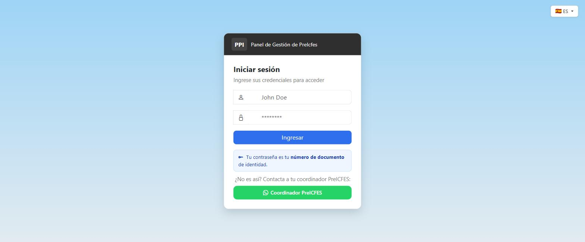
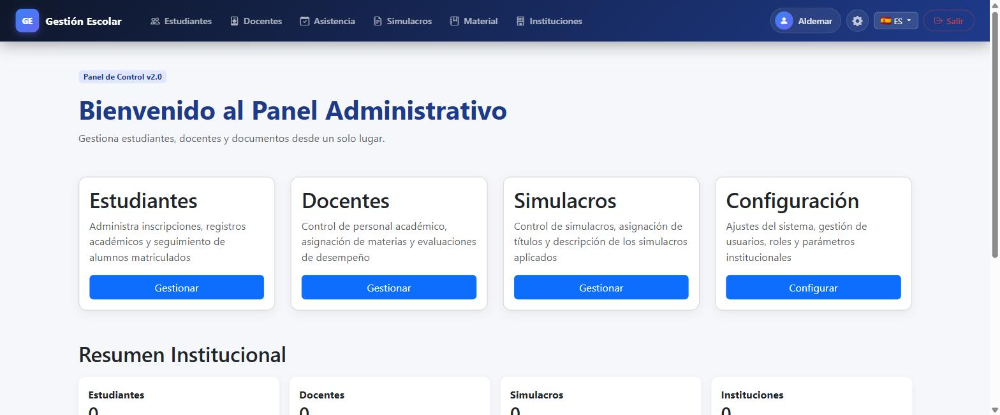
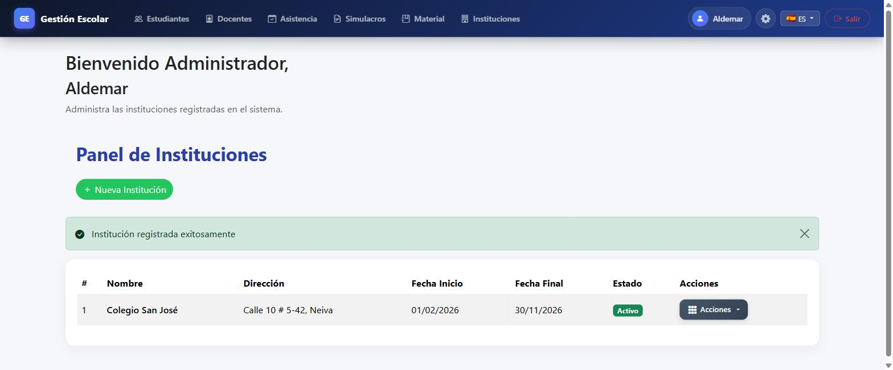
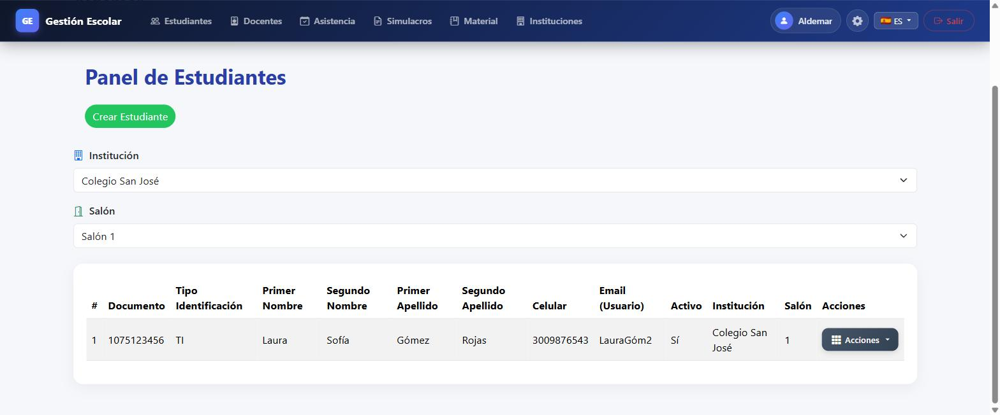
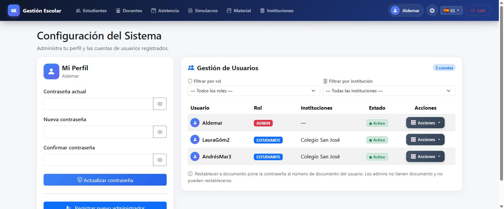
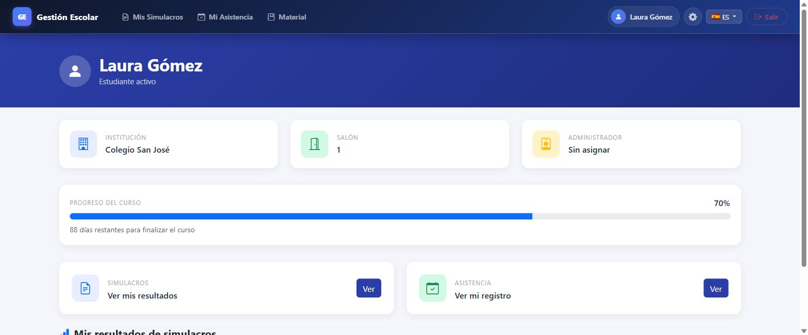

# GestionIcfes

[](LICENSE)
[](https://adoptium.net/)
[](https://spring.io/projects/spring-boot)
[](https://github.com/JuanFierro15/icfes-prep-management-system/actions/workflows/ci.yml)

Sistema web para la gestión académica de instituciones de preparación para el examen ICFES. Permite administrar estudiantes, docentes, simulacros, asistencias y materiales de estudio desde un panel centralizado con control de acceso por roles.

---

## Tecnologías

| Capa | Tecnología |
|---|---|
| Backend | Java 21 · Spring Boot 4.0.6 · Spring Security · Spring Data JPA |
| Frontend | Thymeleaf · Bootstrap · CSS personalizado |
| Base de datos | PostgreSQL 15+ |
| Build | Maven 3.9+ (con wrapper `./mvnw`) |
| Contenedores | Docker · Docker Compose |
| Otros | Lombok · DevTools · thymeleaf-extras-springsecurity6 |

---

## Funcionalidades por rol

### Administrador
- Gestión completa de estudiantes y docentes (crear, editar, eliminar)
- Registro y administración de instituciones con fechas de inicio y cierre
- Creación de simulacros y carga de resultados en PDF por estudiante
- Registro de asistencias diarias por salón
- Subida de materiales de estudio por semana
- Panel de configuración: cambio de contraseña, activar/desactivar usuarios, restablecer contraseñas
- Log de auditoría de todas las acciones del sistema

### Docente
- Panel con resumen de progreso de la institución
- Cambio de nombre de usuario y contraseña propios

### Estudiante
- Consulta de simulacros y descarga de resultados en PDF
- Historial de asistencias
- Acceso a materiales de estudio por semana
- Cambio de nombre de usuario y contraseña propios

### Automatización
- Cierre automático de instituciones: al llegar la `fechaFinal`, todos los usuarios asociados son desactivados automáticamente cada noche a medianoche.

---

## Requisitos previos

- Java 21
- Maven 3.9+ (opcional: el repo incluye el wrapper `./mvnw`)
- PostgreSQL 15+ corriendo en `localhost:5432`

Para la ejecución con contenedores solo se necesita **Docker** y **Docker Compose**.

---

## Configuración y ejecución

### 1. Clonar el repositorio

```bash
git clone https://github.com/JuanFierro15/icfes-prep-management-system.git
cd icfes-prep-management-system
```

### 2. Crear la base de datos

```sql
CREATE DATABASE gestionicfes;
```

### 3. Configurar credenciales de base de datos

La conexión se resuelve por variables de entorno con valores por defecto para
desarrollo local (ver `src/main/resources/application.properties` y
`.env.example`):

| Variable | Por defecto | Descripción |
|---|---|---|
| `SPRING_DATASOURCE_URL` | `jdbc:postgresql://localhost:5432/gestionicfes?useSSL=false&serverTimezone=UTC` | URL JDBC |
| `SPRING_DATASOURCE_USERNAME` | `postgres` | Usuario |
| `SPRING_DATASOURCE_PASSWORD` | `tamao` | Contraseña |

Si tu PostgreSQL local usa otra contraseña, expórtala antes de arrancar:

```bash
export SPRING_DATASOURCE_PASSWORD=tu_contraseña
```

### 4. Ejecutar la aplicación

```bash
./mvnw spring-boot:run
```

El esquema de tablas se crea automáticamente (Hibernate DDL `update`). Los roles y el usuario administrador por defecto se inicializan solos en el primer arranque — no se requiere ningún SQL manual.

La aplicación queda disponible en: **http://localhost:8080**

---

## Ejecución con Docker

Levanta la aplicación y su base de datos con un solo comando:

```bash
docker compose up --build
```

Esto arranca:

- `db` — PostgreSQL 15 con un volumen persistente (`postgres_data`)
- `app` — la aplicación empaquetada, expuesta en **http://localhost:8080**

Las credenciales del contenedor se pueden personalizar copiando `.env.example` a
`.env` y ajustando `DB_NAME`, `DB_USER` y `DB_PASSWORD`.

Para detener y eliminar los contenedores:

```bash
docker compose down          # conserva los datos
docker compose down -v       # elimina también el volumen de la base de datos
```

---

## Credenciales por defecto

| Rol | Usuario | Contraseña |
|---|---|---|
| Administrador | `Aldemar` | `AFC` |

> Las contraseñas de estudiantes y docentes recién creados son su número de documento de identidad.

---

## Comandos útiles

```bash
# Compilar y empaquetar (genera target/GestionIcfes-1.0.jar)
./mvnw clean package

# Ejecutar la aplicación en modo desarrollo
./mvnw spring-boot:run

# Ejecutar tests (requiere PostgreSQL activo)
./mvnw test

# Compilar + tests + verificaciones (lo que corre en CI)
./mvnw verify

# Ejecutar una clase de test específica
./mvnw test -Dtest=GestionIcfesApplicationTests
```

---

## Internacionalización

La aplicación soporta cuatro idiomas. Para cambiar el idioma, agregar `?lang=` a cualquier URL:

| Parámetro | Idioma |
|---|---|
| `?lang=es` | Español (predeterminado) |
| `?lang=en` | English |
| `?lang=fr` | Français |
| `?lang=it` | Italiano |

---

## Estructura del proyecto

```
.
├── .github/workflows/ci.yml   → Integración continua (build + tests con PostgreSQL)
├── Dockerfile                 → Imagen multi-stage (build Maven + runtime JRE 21)
├── docker-compose.yml         → Orquestación app + base de datos
├── .env.example               → Plantilla de variables de entorno
├── pom.xml                    → Dependencias y configuración de build Maven
└── src/
    ├── main/java/co/edu/local/gestionIcfes/
    │   ├── config/            → Seguridad, i18n, inicialización de datos, MVC
    │   ├── controller/        → Controladores MVC por rol (Admin, Docente, Estudiante, Usuario)
    │   ├── dto/               → Objetos de transferencia de datos para formularios
    │   ├── enums/             → TipoIdentificacion, EstadoInstitucion, EstadoAsistencia
    │   ├── model/             → Entidades JPA
    │   ├── repository/        → Repositorios Spring Data JPA
    │   ├── services/          → Interfaces de servicios
    │   └── servicesImpl/      → Implementaciones + scheduler de cierre de instituciones
    ├── main/resources/
    │   ├── templates/         → Vistas Thymeleaf organizadas por rol
    │   ├── static/            → CSS, JS e imágenes
    │   ├── messages*.properties → Traducciones (es, en, fr, it)
    │   └── application.properties → Configuración de la aplicación
    └── test/                  → Pruebas (JUnit 5 + Spring Boot Test)
```

---

## Seguridad

El acceso está protegido por Spring Security con autenticación por formulario y redirección por rol:

| Ruta | Rol requerido |
|---|---|
| `/admin/**` | ROLE_ADMIN |
| `/docente/**` | ROLE_DOCENTE |
| `/estudiante/**` | ROLE_ESTUDIANTE |
| `/login`, recursos estáticos | Público |

Las contraseñas se almacenan con BCrypt.

---

## Capturas de pantalla

### Inicio de sesión
Autenticación por formulario con selector de idioma.



### Panel administrativo
Vista principal del administrador con accesos directos y resumen institucional.



### Gestión de instituciones
Registro de instituciones con fechas de inicio y cierre y estado.



### Gestión de estudiantes
Listado filtrable por institución y salón.



### Configuración del sistema
Gestión de cuentas, roles, estados y restablecimiento de contraseñas.



### Panel del estudiante
Resumen de progreso del curso, simulacros y asistencia.



---

## Equipo de desarrollo

Proyecto académico desarrollado para la asignatura de Programación Web — Universidad Surcolombiana (USCO).

| Autor | GitHub |
|---|---|
| Juan Fierro | [@JuanFierro15](https://github.com/JuanFierro15) |

---

## Licencia

Distribuido bajo la licencia **MIT**. Consulta el archivo [LICENSE](LICENSE) para más detalles.
